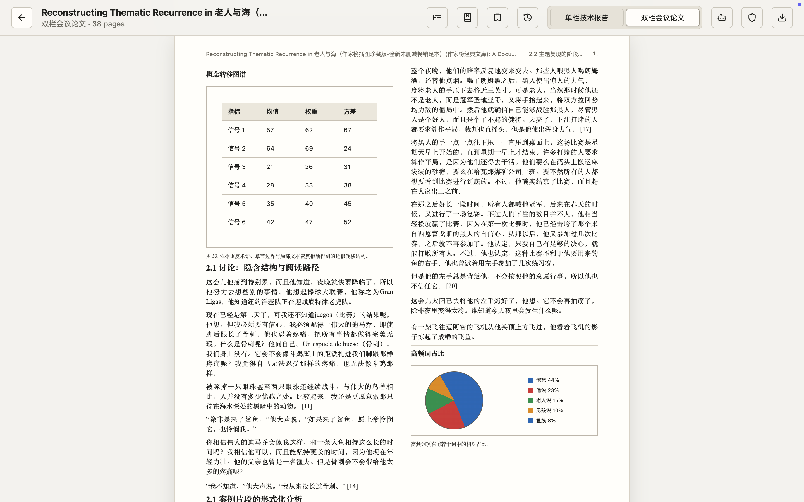
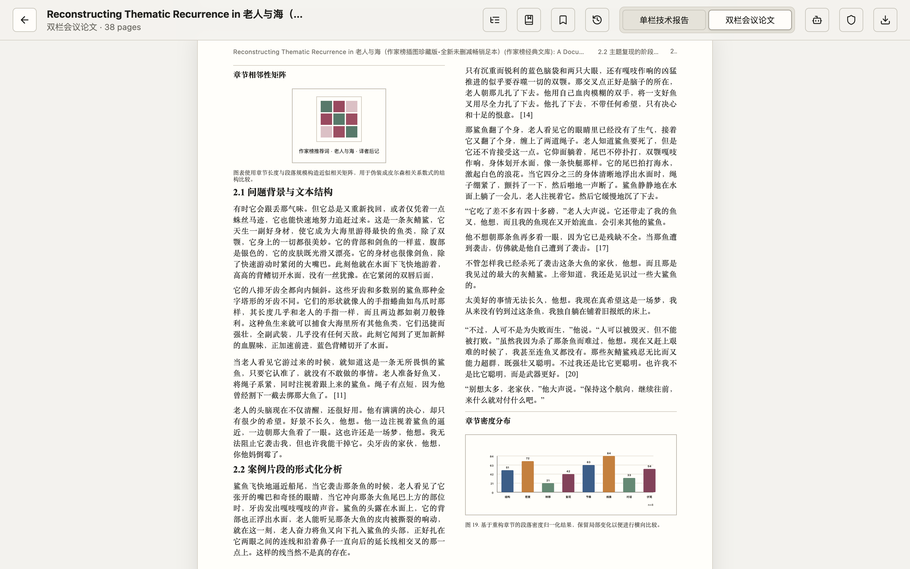
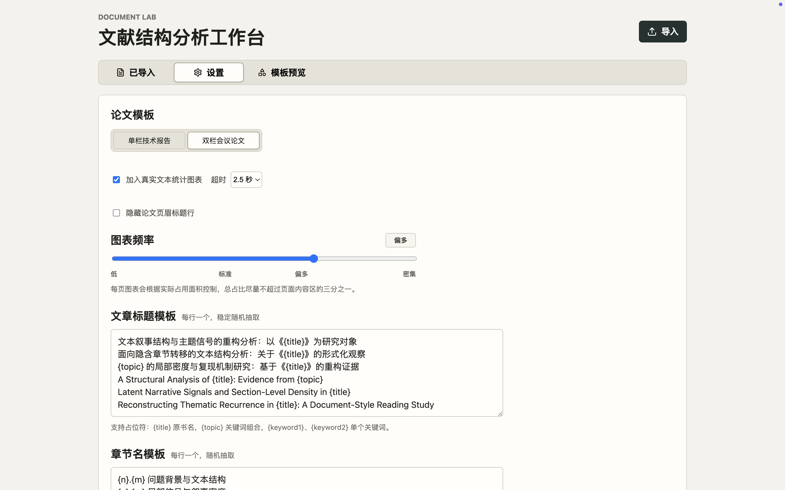
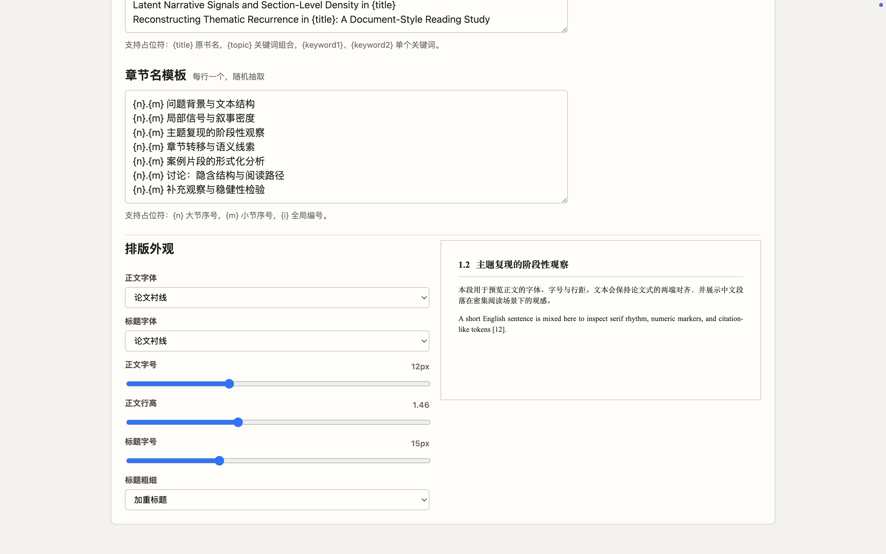

# Book2Paper

你是否也有一样的困扰：

在 vibe coding 的时候，模型慢得像蜗牛。你越等越焦躁，越焦躁越想摸点什么。

可是如果玩手机、看小说，路过工位的人又很容易误会：这个人是不是没有在认真工作？

那么，如何在不那么显眼的情况下，让焦急等待的自己有事做呢？

让 Book2Paper 来帮你。

Book2Paper 可以把本地小说转换成论文风格的阅读界面，支持 `.epub` 和 `.txt`。原本的小说正文会被排成单栏或双栏论文，混入标题、图表、公式、表格、章节编号和看起来很学术的结构。别人路过时，只会觉得：

> 好认真，居然在看论文。

它还支持自定义图表模板、图表频率、章节标题模板、论文标题模板和屏蔽词，方便适配不同学科的学（摸）习（鱼）需求。

## 预览

<p align="center">
  <sub>把小说转换成看起来像论文的双栏阅读界面，混入标题、图表、表格和章节结构。</sub>
</p>

<table>
  <tr>
    <td width="50%">
      
    </td>
    <td width="50%">
      
    </td>
  </tr>
  <tr>
    <td align="center">
      <br>
      <sub>双栏会议论文视图 · 第 1 页</sub>
    </td>
    <td align="center">
      <br>
      <sub>双栏会议论文视图 · 第 2 页</sub>
    </td>
  </tr>
</table>

<details>
<summary>设置与模板预览</summary>

<br>

<table>
  <tr>
    <td width="50%">
      
      <br>
      <sub>调节论文模板、真实文本统计图表和图表出现频率。</sub>
    </td>
    <td width="50%">
      
      <br>
      <sub>自定义文章标题、章节名模板和整体排版外观。</sub>
    </td>
  </tr>
  <tr>
    <td width="50%">
      
      <br>
      <sub>预览和选择图表模板。</sub>
    </td>
    <td width="50%">
      
      <br>
      <sub>添加屏蔽词后可以重新生成图表，避免出现过于显眼的文本特征。</sub>
    </td>
  </tr>
</table>

</details>

## 功能

- 支持导入 `.epub` / `.txt`
- 将正文转换为论文式阅读页面
- 支持单栏、双栏论文模板
- 支持图表、表格、公式、流程图等多种模板
- 支持真实文本统计图表和屏蔽词
- 支持自定义章节名模板和文章标题模板
- 支持导出 PDF
- 支持 macOS 和 Windows 安装包

## 下载

请前往 Release 页面下载：

[Book2Paper Release](https://github.com/wyysteelhead/book_to_paper/releases)

macOS 用户下载 `.dmg`，Windows 用户下载 `.exe`。

GitHub 页面里自带的 `Source code.zip` / `Source code.tar.gz` 是源码包，不是安装包。请下载 Assets 区域里的 `.dmg` 或 `.exe` 文件。

### macOS 提示“已损坏”怎么办？

当前版本暂未做 Apple Developer ID 签名和公证，macOS 可能会提示应用“已损坏”或“无法打开”。这通常不是文件真的坏了，而是 Gatekeeper 拦截了未公证应用。

如果你已经把应用拖到 `Applications`，可以在终端执行：

```bash
xattr -cr /Applications/Document\ Lab.app
```

然后重新打开应用即可。

## 使用方法

1. 下载并安装对应系统的安装包。
2. 打开应用。
3. 点击右上角导入按钮，选择 `.epub` 或 `.txt` 文件。
4. 在设置中选择单栏或双栏、图表频率、是否使用真实数据等选项。
5. 开始阅读伪装成论文的正文。
6. 如有需要，可以导出 PDF。

## 免责声明

本项目纯属瞎做，主要用于缓解等待模型时的精神内耗。

如果你因为使用本工具被领导、同事、导师、甲方、家属或任何路过工位的人发现，或者因为使用过度导致工作延期、学习停滞、DDL 爆炸，本项目概不负责。

请适度使用。论文是假的，等待是真的，生活还是要继续的。
